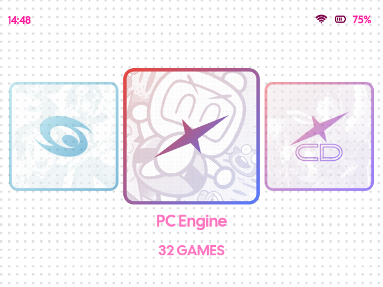
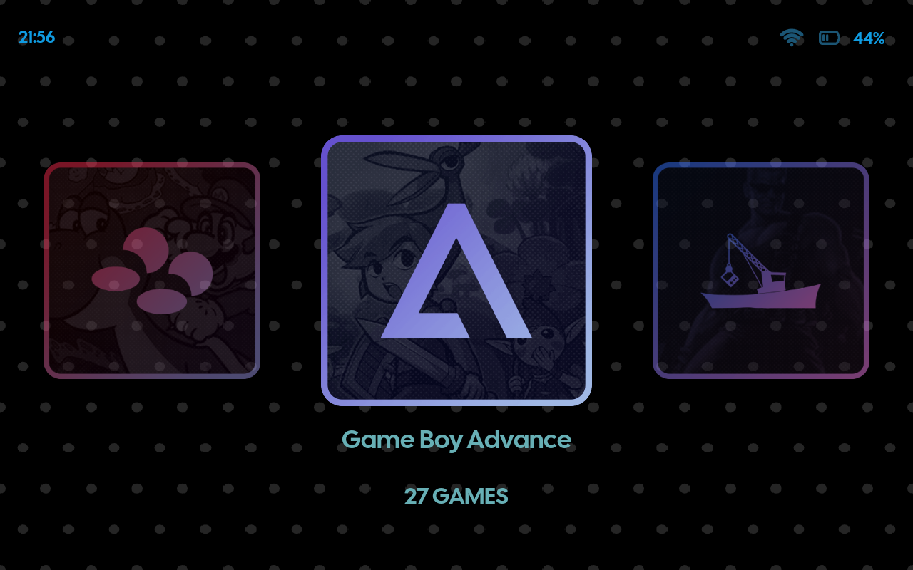
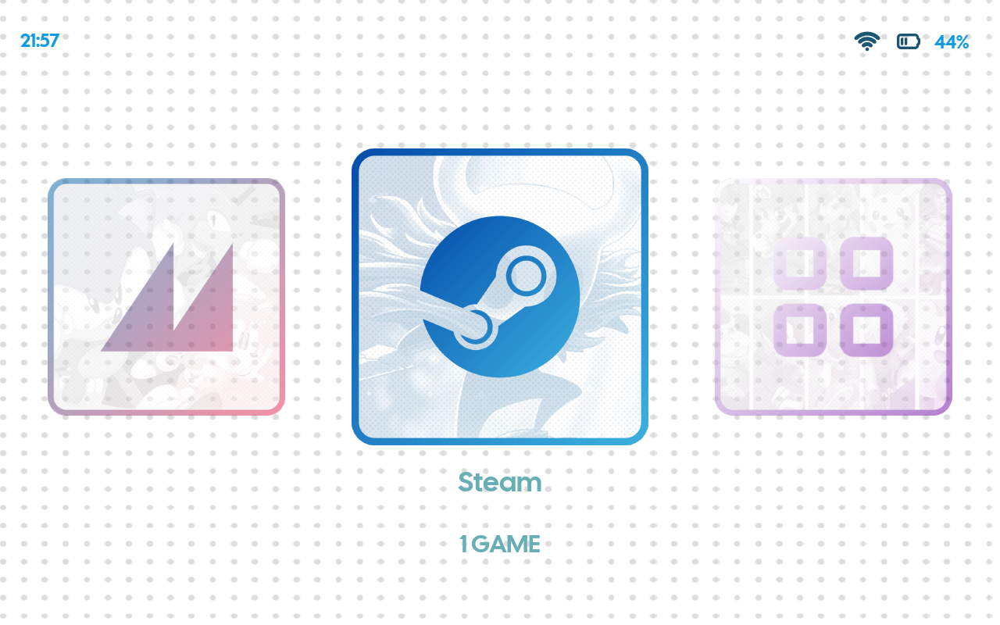
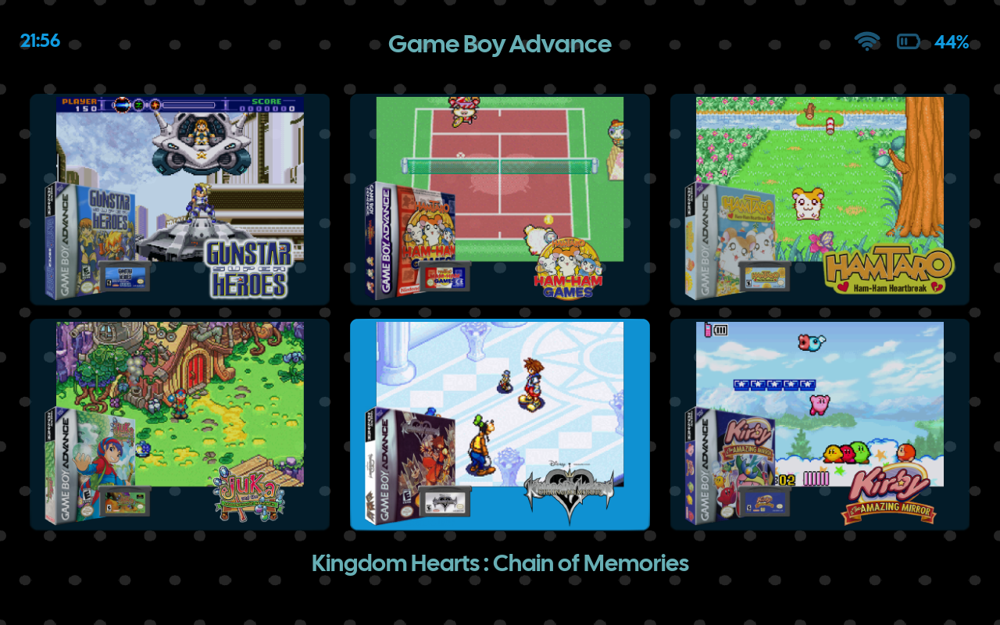
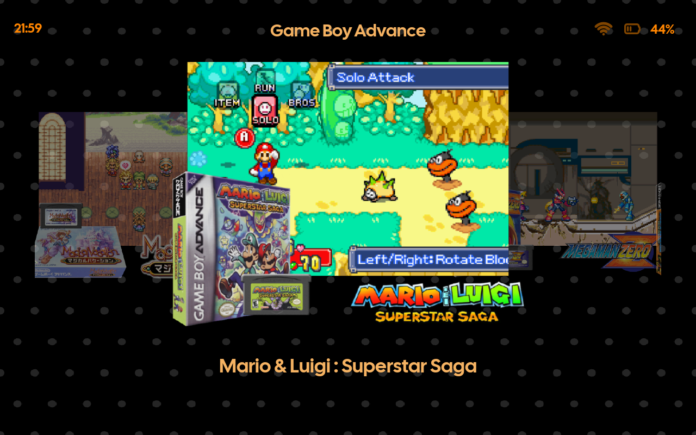
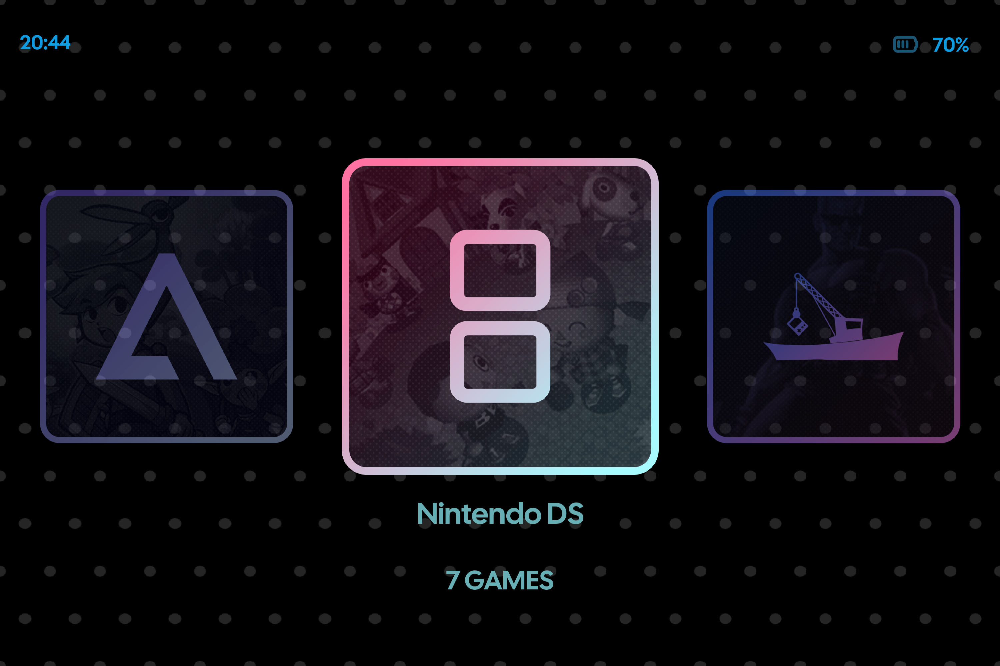
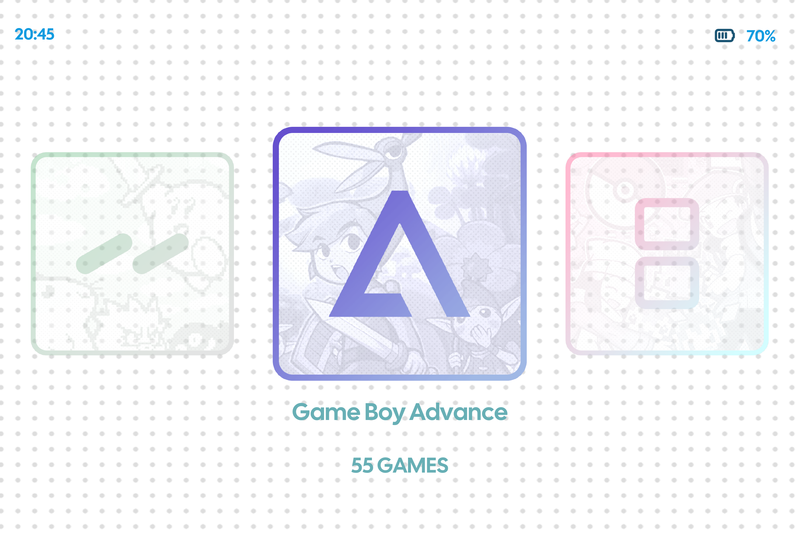
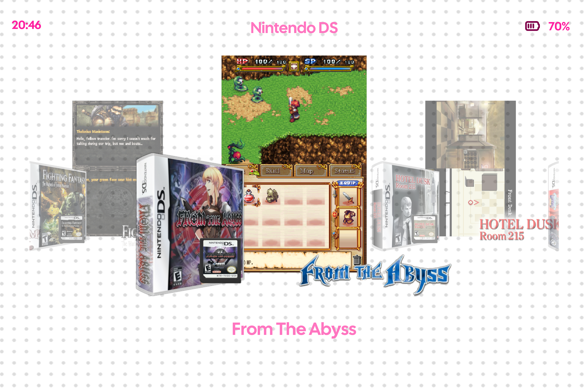
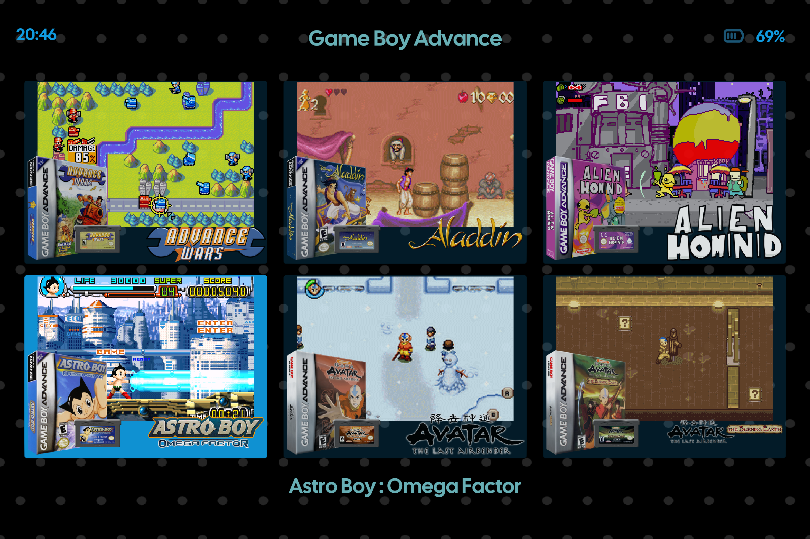

# LethalTheme-ES
#### A simple EmulationStation theme using system icons from [iiSU](https://iisu.network/) and inspired by the layout and design of [TechDweeb's](https://github.com/TechDweeb/techdweeb/releases) theme, designed primarily for the RG35XXSP running Knulli
## Theme Preview
|  |  |
| -- | -- |
|  |  |
|  |  |
|  |  |

## Installation
1. Download the latest release from the [releases](https://github.com/LucasAlexandrou/LethalTheme-ES/releases) page
2. Extract the "LethalTheme-ES" folder
3. Copy the folder into your EmulationStation themes directory
4. Select **LethalTheme-ES** in your device's theme settings
5. Configure settings to your own liking

## Customization
* Choose between light or dark themes with multiple secondary colour options for text and highlights including:
  * Light Cyan
  * Light Pink
  * Light Yellow
  * Light Orange
  * Dark Purple
  * Dark Green
  * Dark Orange
  * Dark Cyan
* Multiple choices for game views: Basic, Detailed, Grid, Carousel

## Aspect Ratio
This theme was designed on a 4:3 screen, however it uses responsive layout that works well across other tested aspect ratios such as 3:2 and 16:10 displays
### 16:10
|  |  |
| -- | -- |
|  |  |

### 3:2
|  |  |
| -- | -- |
|  |  |

## Credit
All system icons were created by the talented team at [iiSU](https://iisu.network/) and can be found on [iiDB](https://iidb.iisu.network/).
The theme's layout and design were inspired by [TechDweeb's](https://github.com/TechDweeb/techdweeb/releases) theme
